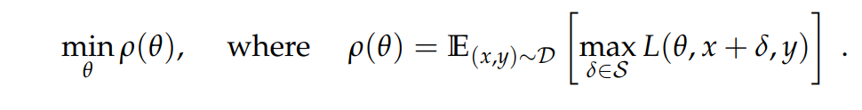
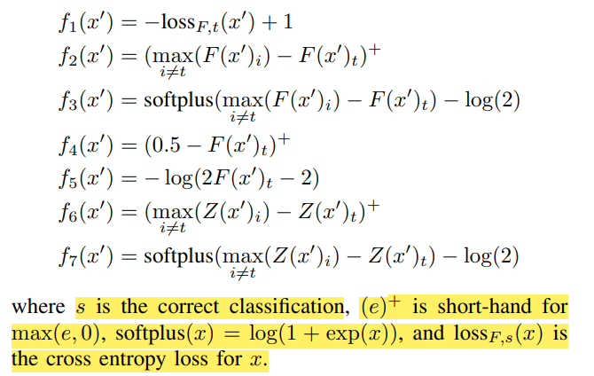
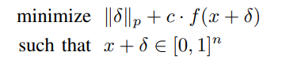
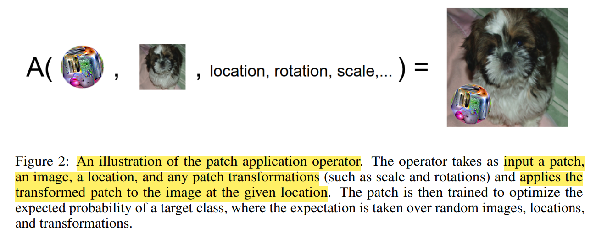

# 2023.07-2023.08总结

## 前言

对抗样本主要分为**攻击**和**防御**两个方向

- 从攻击的角度来看，按照是否知道攻击模型的信息（模型结构、参数、梯度等）可分为白盒攻击和黑盒攻击

- 在白盒攻击中，一般是添加一些微小的扰动来使模型做出错误判断，**按照扰动添加的范围**可分为**Lp**和**Patch**两种
- 在黑盒攻击中，可分为迁移、score-based query、decision-based query三类。
- 防御方法：对抗训练、防御性蒸馏

## 白盒攻击

在白盒攻击中，攻击者可以利用模型的详细信息，包括结构、参数以及训练数据等。这使得攻击者能够更准确地分析模型的行为和决策过程。通过使用`反向传播（back-propagation）方法`，攻击者可以计算出模型对于输入数据的梯度，这些梯度表示了输入数据对于模型输出的影响程度。基于这些梯度信息，攻击者可以采用各种`梯度下降优化算法`，如基于梯度的优化算法（如FGSM、PGD、C&W等），来调整输入数据，以生成能够欺骗模型的对抗样本。

### Lp

#### FGSM

##### 主要思想

FGSM利用模型的梯度信息，计算输入图像关于损失函数的梯度。然后，通过在输入图像中添加一个小的扰动，**该扰动的方向与梯度的符号相同（用符号函数sign将梯度值变为+1或者-1），攻击者可以改变图像，以便在最大程度上增加损失函数的值**，导致模型将其错误分类

作者认为模型对于微小的扰动敏感的原因是利用了**模型线性的特性和梯度信息、以及输入的高维特性**。

##### 优点和不足

- **优点：** FGSM操作简单，只需要一次梯度计算，生成速度较快。它通常能够成功生成相对较弱的对抗样本，使得原始图像被错误分类。
- **不足：** 由于只考虑了一次梯度，FGSM生成的对抗样本可能对抗性较弱，容易被模型检测出来。这种方法可能无法应对一些鲁棒性较强的模型。

#### I-FGSM

##### 主要思想

IFGSM是FGSM的改进，它引入了迭代的概念。攻击者多次应用FGSM，并在每一步之后Clip中间结果的像素值，以确保它们位于原始图像的值域，每次微调图像以生成更强的对抗扰动。

此外，作者还将IFGSM应用于真实世界中，打印了对抗图像，用手机和摄像机拍照进行了实验

##### 优点和不足

- **优点：** IFGSM能够生成更强的对抗样本，其效果通常比FGSM更好。迭代的过程使得扰动更加复杂，更难以被模型检测出来。
- **不足：** 迭代次数过多可能导致对抗样本过于接近于原始样本，人类视觉难以察觉。然而，过多的迭代也会增加攻击时间

#### DeepFool

##### 主要思想

DeepFool的核心思想是在输入数据空间中找到一个最小扰动的超平面，将原始样本从一个类别移到另一个类别。通过线性逼近模型的决策边界，DeepFool计算需要的最小扰动来实现错误分类

 **改变分类器决策**的**最小扰动对应于 x0 在F上的正交投影**（用人话说就是：**如果想改变其中某点的分类结果，一定要跨过分割平面。显然最短的移动距离就是垂直分割平面进行移动**。）

推而广之，在二分类问题中，当分割平面不是线性时，我们假设当移动的距离很小时，分割平面相对该点可以认为依然是一个线性的分割平面，每次迭代时，该点都以很小的移动距离不断逼近分割平面

多分类问题时，与二分类问题类似，只不过在迭代计算时需要考虑**该点向不同分类标签移动时要选取一定距离最短的那个**

##### 优点和不足

- **优点：** DeepFool在一些情况下能够产生非常小的扰动，从而使得对抗样本在人类视觉上更难以察觉。
- **不足：** 与其他方法相比，DeepFool的鲁棒性可能较低，特别是在应对一些防御策略时。此外，**由于需要进行多次迭代和线性逼近，攻击时间可能较长**

#### PGD

##### 主要思想

1. **梯度下降（Gradient Descent）：** PGD首先使用标准的梯度下降方法来最小化一个损失函数，该损失函数通常是原始任务的损失函数，例如分类任务中的交叉熵损失。梯度下降旨在找到能够在训练数据上表现良好的参数。
2. **投影（Projection）：** PGD在每次迭代时引入了一个关键步骤，即**将生成的对抗性样本投影回一个合理的范围内**，以确保生成的样本在可接受的输入空间内。这是为了防止对抗性扰动过大，使得样本变得不现实或不自然。
3. **扰动（Perturbation）：** 在每次迭代中，PGD在当前输入样本的基础上添加一个小的扰动，以在损失函数的梯度方向上移动一小步。这个扰动是通过在一个预定义的范围内找到一个最大化损失函数梯度的向量来计算的。这个步骤是为了生成一个新的样本，它在损失函数上具有较大的梯度。
4. **多次迭代：** PGD通过多次迭代上述步骤来生成对抗性样本。每次迭代都会在前一次迭代生成的样本基础上进行微小的调整，从而逐步逼近原始输入样本的对抗性版本。

提出了一个**min-max**框架，使用**一个鞍点公式来描述对抗鲁棒性问题**

我们的观点源于将鞍点问题视为**内部最大化问题和外部最小化问题的组合**。

- **内部最大化旨在找到给定数据样本x的对抗样本δ（δ∈S），以获得尽可能高的loss（这正是攻击神经网络所期望的：loss越大，说明对抗攻击越有效）。**
- **外部最小化是旨在找到模型参数θ，以使得内部攻击问题给定的`对抗损失`最小化（即优化网络，基于内部对抗样本最小化损失函数，这正是使用对抗训练技术训练鲁棒性模型所期望的）。**
- 其次，**该范式也对鲁棒模型应该满足的条件提出了明确的目标**（**通过优化损失函数实现**）。特别地，**当通过该范式求解得到的网络参数有消失的风险时，可能正说明此时的模型具有对抗鲁棒性。**

**尽管这个鞍点问题是个非凸也非凹的问题，但仍然可以用一阶方法解决**。作者用的就是PGD，这是一种**利用局部一阶信息求解**的优化方法。

**此外，作者研究了模型容量和鲁棒性的关系**

##### 优点和不足

**优点：**

1. **鲁棒性提升：** PGD算法可以生成对抗性样本，这些样本被精心设计以欺骗机器学习模型。通过使用PGD生成的对抗性样本来训练模型，可以提升模型的鲁棒性，使其在面对未知的、略有不同的输入时也能保持高性能。
2. **可调参数：** PGD算法有几个参数可以调整，如迭代次数、步长等。这些参数可以根据问题的特性进行调整，以便在特定应用中获得更好的性能。
3. **通用性：** PGD不依赖于特定的模型结构，因此可以应用于各种机器学习模型，包括神经网络、支持向量机等。
4. **可解性**：在PGD中，即使最终的训练任务是个非凸、多局部极值点的问题，但是问题仍然是可解的，因为这些极值点比较集中

**不足：**

1. **过度估计：** PGD算法可能会过度估计模型的鲁棒性，导致生成的对抗性样本在实际应用中并不一定是最具挑战性的情况。这可能会导致在一些情况下，模型在面对真实世界的对抗性攻击时表现不佳。
2. **过拟合：** **对抗训练出来的模型在测试集上的分类精度会有所下降**。根据上面的分析，**对抗训练得到的模型边界更加复杂，则对于干净样本来说模型此时是过拟合状态，即模型在测试集上的精度有所下降。**
3. **参数选择敏感性：** PGD的性能很大程度上取决于参数的选择，如迭代次数、步长等。不当的参数选择可能会导致算法性能下降或者失效。
4. **时间性**：虽然鞍点问题的解决是有保障的，但是能否在合理的时间内找到一个好的解决方案尚不清楚

#### CW

##### 主要思想

CW攻击是一种**基于优化**的方法，目标是通过解优化问题，找到最小的扰动，使得对抗样本被错误分类到目标类别。攻击者通过引入一个`修正因子c`，考虑了对抗样本的可视性和攻击强度的平衡，以便生成更难以察觉的对抗样本。

- c>0是一个惩罚因子，用于权衡目标和约束的重要性
- f(x+δ)是目标函数，它有以下7种选择
- 

其中：

- （1）对目标标签的损失函数进行优化，这个目标函数和 L-BFGS Attack 相类似。f1函数和L-BFGS中的L(.)项都是针对目标模型的真实损失函数，只不过f1中做了一点改变。
- （2）对目标标签的置信度进行优化，希望其成为最后预测值。
- （3）也是对目标标签的置信度进行优化，形式不同，max函数更换成softplus函数。
- （4）也是对目标标签的置信度进行优化，希望其成为最大可能类。
- （5）同4。
- （6）对目标标签的 logit 值进行优化。同 2.
- （7）也对目标标签的 logit 值进行优化，同 3.

在用Lp范数实例化度量距离D之后，问题变为：给定x，找到可求解的δ

为了确保修改产生有效的图像，对δ进行了约束：**对于所有i，我们必须使 0≤xi+δi≤1** 。 在优化文献中，这称为`盒约束`，作者用的是`change of variables`方法：

- **Change of variables**：为了解决上述的两个问题，本文提出了换元的方法，通过引入新的变量`w`使得扰动的表达式变为`δ = (tanh(w_i)+1)/2 - x_i`，由于tanh函数本身的值域范围为[-1,1]，这样就保证了x + δ的范围在[0,1]之间，同时，因为tanh函数在全定义域内导数均不为0，也就克服了Clipped gradient descent方法的缺点。这样做还有另一个好处，由于像素值的限制靠的是损失函数本身的值域而非人工截断，那么就可以引入一些不支持人工截断的优化器，例如Adam，作者通过实验发现Adam在保证攻击效果的前提下实现了更快的收敛速度。

作者分别对D尝试了L0、L2、L∞，对f函数尝试best case、average case和worst case的情况。

打破了防御性蒸馏。

#### DAG

##### 主要思想

将对抗样本应用于目标检测和语义分割领域上。

**DAG是一种同时考虑所有目标并优化整体损失函数的算法。它的实现很简单，只需要为每个目标指定一个对抗性标签，并执行迭代梯度反向传播。**

即定义一组密集的target和一组不同的期望标签，并优化损失函数，以便同时对所有目标产生错误的识别结果

##### 优点和不足

**优点**：

- DAG可以在不同的任务、模型和训练数据集上具有迁移性
- 联合多个扰动的效果比单个扰动效果更好，这对黑盒攻击有帮助

**不足**：

- 对检测网络的攻击，修改了网络结构，不具有说服力
- 做迁移实验时，所使用的网络同构严重，迁移性不具有说服力

#### AutoAttack

##### 主要思想

- 针对PGD进行了修改，提出了Auto-PGD
  - 在PGD基础上加入**动量方法、重启方法及步长衰减**， 从而实现**自适应地调整迭代步长**，避免超参的设置。
  - 将迭代过程分为**初始探索阶段和开发阶段**。在初始探索阶段，寻找可行的较好的起始点，在开发阶段通过逐渐减小步长来使目标函数局部最大化。
- 将所提出的新的PGD和FAB、Square Attack相结合集成（集成三种方法），提出了AutoAttack
- 提出了DLR Loss（Difference of Logits Ratio Loss）替代PGD的cross-entropy。DLR loss在 CE loss的基础上有所改善，并且与 CW loss相当，但有更少的失败情况

#### One-shot

##### 主要思想

用于视觉对象跟踪领域，给free-model（即可以识别任意类别）产生单目标跟踪的对抗样本

使用了两个带attention的loss，一个是Batch Confidence Loss，另一个是Feature Loss。

Batch confidence loss 如下：

**目标就是抑制high confidence（R_1:p)的candidates，激励moderate confidence (R_q:r)的candidates**

对于Feature Loss，主要是对了针对高斯窗带来的影响，为了平衡攻击强度和成功率，**需要对全部的候选框的特征空间进行攻击**，表述为

∅(·)代表了feature map，然后计算`z`和`z*`的feature map的**欧氏距离**。其中`C`代表feature map的channel

### Patch

这类方法通常是修改图像的某一个patch的像素就能造成干扰

#### Adversarial Patch

##### 主要思想

提出了一种在现实世界中的通用的image Patches，该patch可以放在图像的任何位置

通过mask patch以使其具有任何形状，然后训练各种图像，对每个图像中的patch应用随机平移、缩放和旋转，并使用梯度下降进行优化。

定义了一个patch application operator `A(p,x,l,t)`

- x：给定的图像
- p：patch
- l：patch location
- t：patch transformation

- 首先将transformation `t`应用在patch `p`上，然后把`p`应用在图像`x`的location `l`上

#### DPATCH

##### 主要思想

一种针对主流目标检测器（Faster R-CNN和YOLO）的基于黑盒对抗patch的攻击。

与仅使用图像级分类器的original adversarial patch不同，我们的**DPATCH同时攻击bounding box回归和对象分类**，从而使其预测失效。**在无目标攻击中，目标检测器无法找到包含正常对象的正确区域**；**在有针对性的攻击中，对象检测器只能检测DPATCH，而忽略图像上的任何其他对象。**

针对图像分类的Adversarial Patch无法欺骗目标检测器，原因在于**检测器体系结构**：现代目标检测器**首先将具有不同大小的物体定位在图像上的不同位置**，**然后进行分类**。因此，**在这种情况下需要攻击的目标数量要比纯分类应用程序中的数量大得多**。例如，F**aster R-CNN会生成大约20k的regions域用于分类，这远远超出了原始对抗补丁可以有效攻击的范围**。

##### 优点与不足

**优点**

- DPATCH的**体积小，其攻击效果与位置无关，因此实施实际攻击非常实用**
- DPATCH仍可以在黑盒设置下执行有效的攻击

#### Indirect Local Attack

##### 主要思想

引入了一种**间接攻击策略**(indirect attack strategy)，即**自适应局部攻击(adaptive local attack)**，旨**在找到最佳图像位置进行扰动，同时保留该位置的标签并生成逼真的分割图**。此外，我们提出了**在全局图像级别上以及为获得欺骗区域的像素方向定位的攻击检测技术**。

实验发现：**更准确的语义分割网络对间接局部攻击更为敏感**，作者是认为**因为使用上下文可以提高分割的准确性，还可以增加网络的感受范围，从而使扰动传播到更远的图像区域**。

## 黑盒攻击

黑盒攻击一般不会知道模型的具体信息，只能通过以下两种方式来尝试攻击：

1.攻击者不直接攻击目标模型，而是先训练一个替代模型，用白盒方法攻击这个替代模型，然后用这个方法攻击目标模型

2.基于query的攻击：攻击者唯一能做的就是给模型输入然后得到输出，根据所用的输出结果分为score-based和decision-based

- score-based：用模型对每个类别的预测概率（softmax给的结果）来进行攻击。在这种情况下，只要目标函数h(x)对任意输入x都存在，那么攻击者就可以重构loss function
- decision-based：用模型最终给定的分类类别来进行攻击

### 迁移

不依赖模型的信息，但是**依赖训练数据的信息**，可以**利用训练数据训练替代模型，从而生成可迁移的扰动**；如果**对抗样本是攻击很多替代模型集成而得到的，攻击成功率可以达到近100%**。

#### MI-FGSM

##### 基本思想

**基于优化和迭代方法生成的对抗样本的可传递性较差，因此使黑盒攻击的有效性降低**

因此提出了一类**基于动量的迭代梯度算法**来增强对抗性攻击。通过**将动量项整合到攻击的迭代过程**中，我们的方法可以**稳定更新方向**，并**在迭代过程中摆脱不良的局部最大值**，从而产生**更具可传递性**的对抗样本。

### score-based query

#### One Pixel

##### 主要思想

**提出用差分进化(differential evolution, DE)提出一种单像素的黑盒攻击方法，唯一可获取的信息就是概率标签**。

作者研究了one-pixel和two-pixel扰动的情况下的搜索空间是什么，然后提出用差分进化算法（DE）来进行优化

具体而言，在每次迭代期间，根据当前解决方案（父代）生成另一组候选解决方案（子代）。然后将子代与相应的父代进行比较，如果他们比父代更适合（拥有更高的价值），则保留。以这种方式，仅比较父代和他的子代，就可以同时实现保持多样性和提高价值的目标。

**关于为什么单像素就能成功？**

- **高维度输入空间**：图像通常具有高维度的像素空间，每个像素都可以被看作是输入空间的一个维度。**在高维空间中，输入点之间的距离可能变得很大（即稀疏分布**），因此即使只在一个像素上进行微小调整，它在高维空间中也可能产生显著的变化。
- **模型复杂性**：**深度神经网络，是高度非线性和复杂的**。这意味着输入像素之间的微小变化可能会在模型的各个层次引发级联效应，最终影响模型的决策。
- **差分进化算法**： "One Pixel Attack" 使用差分进化算法来寻找最佳的扰动。这种算法能够在像素空间中搜索一个相对小的扰动，以最大程度地改变模型的预测结果。由于这个算法可以在高维度空间中搜索，它能够找到一个在人类视觉下难以察觉但对模型有重要影响的扰动。
- **另一个分析**
  - **数据点位于决策边界附近：** 先前的研究已经指出，**许多数据点位于机器学习模型的决策边界附近**。这意味着微小的输入变化可能会导致模型的预测结果发生变化，因为这些数据点本来就处于分类决策的敏感区域。
  - **分析数据点的移动：** 为了深入分析，研究人员将数据点在输入空间中移动了一个小步长，并观察了类别标签的变化情况。这种分析可能有助于理解在高维空间中微小变化对模型的影响。
  - **沿少数维度移动数据点：** 本文的贡献之一是指出，即使**只沿着很少的维度移动数据点，也可以找到导致类别标签变化的点**。这暗示着**模型的决策可能在一些特定维度上特别敏感**，即使在其它维度上进行微小变化。
  - **小尺寸扰动的累积效应：** 文中提到了 "I. J. Goodfellow 等人的假设"，即**小尺寸的扰动可能会在多个维度上累积，并导致输出产生巨大变化**。这个假设意味着即使只改变一个像素，其影响可能会扩散到许多维度上，从而改变整个输入的表示。
  - **自然图像的敏感性：** 这段解释还提到，这些发现可能解释了为什么自然图像对于微小扰动敏感。因此，只更改一个像素可能足以在多个图像上产生干扰，因为模型在高维空间中对于这种微小变化的敏感性。

##### 优点与不足

**优点**

- DE不使用梯度信息进行优化，因此不需要目标函数是可微的或先前已知的。 因此，与基于梯度的方法（例如，**不可微**，动态，噪声等）相比，它可以用于更广泛的优化问题。

**不足**

- 局限性在于**是个搜索，而且图像尺寸越大效果越差**，但是如果迭代次数够，就能找到比较好的解。

#### Adv-watermark

### decision-based query

#### Boundary Attack

##### 主要思想

作者针对decision-based attack提出了Boundary Attack，它从一个很大的扰动开始，然后逐渐寻找减小扰动大小

该算法**从一个已经是对抗样本的点初始化，然后沿着对抗性和非对抗性区域之间的边界执行随机游走**，这样的作用是：

- 它能保留在adversarial region中
- 降低到目标图像的距离

换句话说，就是我们使用合适的**proposal distribution** `P` （即在每一次step中的随机探索的方向）进行**rejection sampling**，**根据给定的对抗标准 c(.) 寻找逐渐变小的对抗扰动**

##### 优点与不足

**优点**

- 首次提出了一种高效的decision-based attacks--Boundary attack。它适应各种尺度的model和datasets，既简单又灵活，微调时不需要直到超参数
- Boundary attack能打破之前的防御方法，例如防御性蒸馏
- Boundary attack能在黑盒攻击上应用。
- 更适合现实场景使用

**不足**

需要大量的查询，且不一定能保证收敛

#### Optimization Attack

##### 主要思想

作者将问题重新表述为**实数值优化问题**（连续而且可以使用零阶梯度估计），使用RGF（Randomized Gradient-Free method），可以取得超过Boundary Attack的性能，同时也是**第一个能保证收敛**的decision-based攻击。

**A Boundary-based Re-formulation**

- θ是搜索方向
- g(θ)是沿着方向θ从x0到最接近的对抗样本的距离

- 不同于搜索对抗样本，**作者做的是搜索方向θ从而最小化g(θ**)
- 最终，对抗样本被通过以下式子找到

**g(θ) 将输入方向映射到实值输出（到决策边界的距离），通常是连续的**，如下图所示

**如何计算g(θ)**

##### 优点与不足

**优点**

适用于离散和非连续的模型。它的query次数更少，理论上有收敛保障，和最好的方法相比可以取得更小的失真，query次数减少3、4倍。

## 防御

### Defensive Distillation

这种方法的核心思想是在训练神经网络时，**将模型的预测输出转化为概率分布，并将这些“软化”的概率分布作为新的标签，然后使用这些标签来重新训练网络**。

#### 主要步骤

1. **Softened Labeling**: 在原始的训练集上，使用已经训练好的神经网络来生成一个“软化”的标签分布。这意味着不再将一个样本的标签仅仅视为一个类别，而是**将每个类别的概率分布作为标签**。**这种“软化”的标签更能够表达模型对输入的不确定性**。
2. **Re-Training**: 使用这些“软化”的标签来重新训练神经网络。**在这个阶段，网络会被要求尽量优化以匹配“软化”的概率分布，而不仅仅是对输入样本进行硬分类**。这有助于网络学会更多的数据结构和特征，使其对于微小的扰动更具鲁棒性。
3. **Inference**: 在测试阶段，通过对网络的输出进行“软化”（即计算概率分布），可以减少对抗性攻击的成功率。攻击者通常会试图通过在输入数据中添加微小的扰动来欺骗网络，但**由于网络输出已经被“软化”，攻击者需要在更高维度的标签空间上进行攻击，从而变得更加困难**。

 为了防御性地蒸馏神经网络，首先要以标准方式在训练数据上训练具有相同架构的网络。当**我们在训练该网络时计算softmax时，将其替换为更平滑的softmax版本（将对数除以某个常数T）**。训练结束时，通过在每个训练实例上评估该网络并获取网络的输出标签来生成软训练标签

然后，**丢弃第一个网络并仅使用软训练标签**。**通过这些标签，训练第二个网络，而不是在原始训练标签上进行训练**。这训练了第二个模型，使其表现得像第一个模型，并且软标签传达了第一个模型学到的其他隐藏知识。

此处的关键见解是，通过进行训练以匹配第一个网络，我们有望避免针对任何训练数据进行过拟合。如果存在神经网络的原因是因为神经网络是高度非线性的并且在对抗样本所在的地方具有“盲点”，那么防止这种类型的过度拟合可能会消除那些盲点。